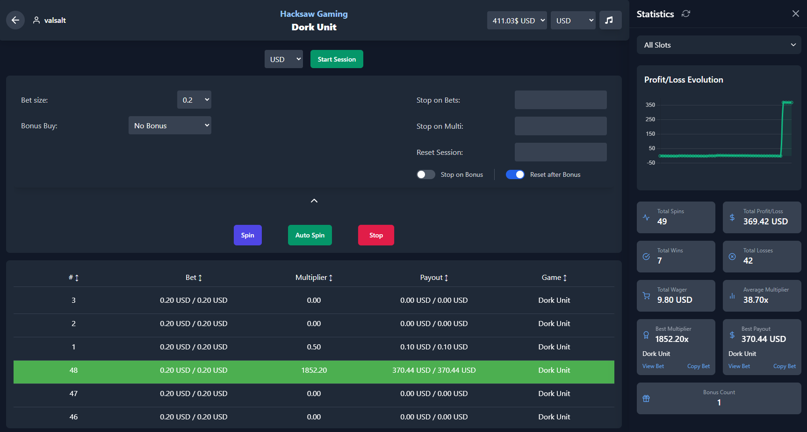

# SSPilot (Stake Spin Pilot)

**SSPilot** est une application innovante conçue pour optimiser et accélérer votre expérience de jeu sur les casinos en ligne, en particulier sur la plateforme **Stake**.

## 📖 Table des Matières

- [📷 Aperçu de l'Application](#-aperçu-de-lapplication)
- [🚀 Fonctionnalités Principales](#-fonctionnalités-principales)
- [⚙️ Fonctionnalités Secondaires](#%EF%B8%8F-fonctionnalités-secondaires)
- [🎰 Providers Supportés](#-providers-supportés)
- [🎲 Jeux Originaux](#-jeux-originaux)
- [🛠️ Installation](#%EF%B8%8F-installation)
- [📚 Guide Rapide](#-guide-rapide)
  - [Configuration Initiale](#configuration-initiale)
  - [Utilisation du Code Claimer](#utilisation-du-code-claimer)
  - [Notifications Telegram](#notifications-telegram)
- [🆙 Mises à Jour](#-mises-à-jour)
- [🤝 Support](#-support)
- [📜 Licence](#-licence)

---

## 📷 Aperçu de l'Application

<!-- Insérez ici des captures d'écran de l'application -->

## 🚀 Fonctionnalités Principales

- **🎰 Spin des machines à sous sans interface** : Profitez d'une expérience de jeu plus rapide en éliminant les interfaces graphiques inutiles.
- **🎲 Spins ultra-rapides sur les jeux originaux** : Augmentez votre efficacité avec des temps de spin réduits.
- **🏹 Bonus hunts automatiques** : Réalisez des bonus hunts sans effort grâce à l'automatisation complète.

## ⚙️ Fonctionnalités Secondaires

- **📊 Exportation des statistiques** : Analysez vos performances en exportant vos données de jeu.
- **📸 Capture d'écran rapide** : Prenez des captures d'écran instantanées de vos sessions.
- **🔔 Notifications Telegram** : Recevez des mises à jour en temps réel directement sur votre Telegram.
- **💾 Sauvegarde automatique des paramètres** : Conservez vos préférences sans action manuelle.
- **🎰 Choix du bonus pour certaines machines à sous** : Sélectionnez le bonus qui correspond le mieux à votre stratégie.
- **🃏 Fonction Gamble (pour certains providers)** : Tentez de multiplier vos gains avec la fonction Gamble.
- **👥 Gestion de multiples instances** : Exécutez plusieurs sessions de l'application simultanément.
- **💬 Auto Post sur le Chat Challenge** : Participez automatiquement aux défis du chat.
- **🛑 Stop on Loss** : Limitez vos pertes en définissant des seuils d'arrêt.
- **💰 Dépôt automatique en coffre sur profit** : Protégez vos gains en les transférant automatiquement dans le coffre.
- **📈 Liste des multiplicateurs** : Suivez en temps réel les multiplicateurs obtenus.
- **🖥️ Interface utilisateur intuitive et personnalisable** : Adaptez l'application à vos besoins.
- **🔄 Mise à jour automatique** : Bénéficiez des dernières améliorations sans intervention manuelle.
- **🎁 Bonus Code Claimer automatique** : Réclamez vos codes bonus sans effort.

## 🎰 Providers Supportés

1. **Hacksaw Gaming**
2. **Backseat Gaming**
3. **Bullshark Games**
4. **Pragmatic Play**
5. **Twist Gaming**
6. **Titan Gaming**
7. **Popiplay**
8. **Octoplay**
9. **B Gaming**
10. **Push Gaming**
11. **Massive Studios**
12. **Endorphina**
13. **Relax Gaming**

## 🎲 Jeux Originaux

- **Dice**
- **Limbo**

## 🛠️ Installation

1. **Téléchargement** : Récupérez le fichier `.exe` de la dernière version de SSPilot depuis notre [page de releases GitHub](https://github.com/McSon2/SSP/releases/latest).
2. **Installation** : Lancez le fichier `.exe` téléchargé et suivez les instructions à l'écran.

> **Note** : Assurez-vous de toujours utiliser la dernière version pour profiter des fonctionnalités les plus récentes et des correctifs.

## 📚 Guide Rapide

### Configuration Initiale

- **Connexion** : Connectez-vous à votre compte **Stake** directement via l'application.
- **Paramètres** : Accédez aux paramètres pour personnaliser votre expérience selon vos préférences.

### Utilisation du Code Claimer

1. Cliquez sur **"Claimer"** dans l'interface principale.
2. Identifiez-vous sur **Stake** (nécessaire uniquement lors de la première utilisation).
3. Laissez la fenêtre ouverte pour permettre la réclamation automatique des codes bonus.

### Notifications Telegram

1. Accédez au bot Telegram : [t.me/sspilot_bot](https://t.me/sspilot_bot)
2. Envoyez la commande `/start` pour initialiser la conversation.
3. Saisissez le code affiché dans l'interface des spins de l'application pour lier votre compte.

## 🆙 Mises à Jour

SSPilot est régulièrement enrichi de nouvelles fonctionnalités et optimisations. Consultez notre [changelog](https://github.com/McSon2/SSP/releases/latest) pour découvrir les dernières mises à jour.

## 🤝 Support

Pour toute assistance ou question :

- **Discord** : Rejoignez notre [serveur communautaire](https://discord.gg/fKQJw8Bcaz) pour échanger avec d'autres utilisateurs et l'équipe de développement.

## 📜 Licence

Ce projet est sous licence **MIT**. Consultez le fichier [`LICENSE`](LICENSE) pour plus de détails.

---

Développé avec ❤️ par l'équipe **SSPilot**.
